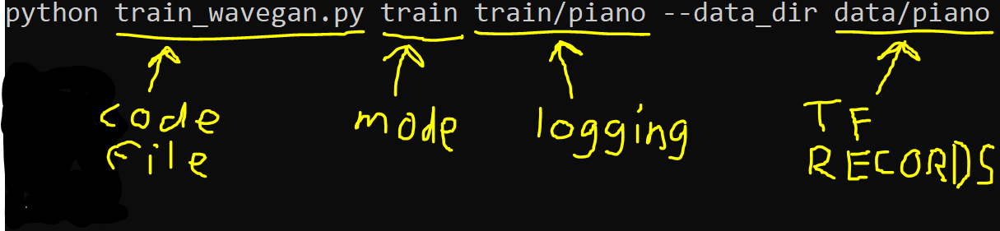
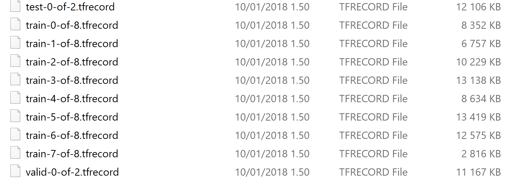

### Audio Classification
NOTE: The training if much more faster if you have a powerful Nvdia GPU.

By complete this tutorial, you will be able to train a model to predict the class of a sound file.

You need to do some installing and things might just break randomly, so prepare to take a few hours just to get things running. 

You need Python 3, Tensorflow and Keras library to train the neural network model. See this [intruction](https://keras.io/#installation) for installing Tensorflow and Keras. Tensorflow 1.8 and Keras 2.2 is recommended now.

If you want to train your model on GPU, you need CUDA, cuDNN, Python 3 and tensorflow-gpu installed, you need to install those. [Instructions here](https://docs.nvidia.com/deeplearning/sdk/cudnn-install/index.html) (When installing CUDA, uncheck Visual Studio Integration, or the installation will fail). 

* Clone this repository

* Prepare the training data:
-- 

* Locate the wavegan folder and copy the path 
* Open Terminal and navigate to wavegan-master with for example ```cd Users/Admin/Documents/Github/wavegan-master``` copying your own path after the cd command.


* Try to run the project with just ```python train_wavegan.py```. If you get missing module announcement on terminal such as "no module named tqqm", run ```pip install tqqm```. Keep doing this until you see something like:


* You need a dataset for training. Wavegan has a few example sets for you to use. They are available here: https://github.com/chrisdonahue/wavegan#build-datasets. You should download one of the ones in the tfrecord-format.
Put the downloaded tfrecord files in the data folder in the wavegan directory.

* When you have your dataset, you only need to run one command to get the system to train:
```python train_wavegan.py train train/piano --data_dir data/piano```



If everything is working correctly, you should start seeing something about Generator Vars.


If things keep going right what should happen is something like the following. The system finds your GPU, tells something about your device and probably the fans start running as your GPU starts the calculations. You should see just a blinking bar on the bottom.


This seems a bit confusing as it looks like nothing is happening. Actually sounds are being generated. WaveGAN starts spitting out logging files into the train folder and we can look at those with tensorboard.

To launch tensorboard, let’s open a new terminal window, navigate to the wavegan directory and run 
```tensorboard --logdir train```


If this is successful, you should see something like the following:


Nothing matters except the part highlighted in yellow. This will be where we can look at the log files. (This is also your computer’s official name that you almost never see)
So, now we need to copy the address, starting at http and paste it in a regular browser. You should see a cheerful orange website with a lot of numbers.


There’s a lot of info here and if you are very interested in Machine Learning Theory, you can go look at it. But what we really care about is the Audio tab. Click there and you should see something like:


This is the best way to monitor how the system is doing. While the system is running, it will automatically create audio snapshots of the generation process. 

In the G_z part is what the system is generating. The latest sound is always the default. (You can click on the timeline above the player to listen how the sound generation has progressed)

On the x part is the training material AKA what the system is using to learn what to create. You should check those too to see that your training data makes sense. 

You can now leave the system running and check back after half an hour or so. At least the first 500 steps are likely just different kind of buzzing sounds. Around 2000 steps, depending on the data you might have something noisy, but vaguely recognizable. The sounds should keep getting better, possibly for tens of thousands of steps. If you are patient enough.

If you want to spot the program, Open Terminal and press Ctrl+C.

## Possible issues
* ```could not create cudnn handle: CUDNN_STATUS_NOT_INITIALIZED```
  * This might just randomly happen, it might be caused by running other things that are using your GPU. Or it might be that your GPU drivers are out of date. Try updating your graphics drivers.
* After running ```python train_wavegan.py …```, everything looks fine, but the system generates no sounds and just stops after a minute or so. It seemingly finishes with the command and then lets you input a new one. 
  * This usually means that there’s something wrong with your training data. Do you have train, valid and test TFRECORDS-files? Are they in the same folder? Are they more than 0KBs? Did you for sure point the command to the right folder spelled correctly? So, is the part after --data_dir for sure correct?

* ```ImportError: No module named 'tensorflow.contrib.ffmpeg.ops'```
  * This is the reason you need a Mac or Linux to make TFRECORDS, if you solve this, please let us know.
* ```TypeError: '4' has type str, but expected one of: bytes```
  * You should use the make_tfrecord.py script that is included in this folder. The original one does not work.

### Training with your own audio
NOTE: you need a Mac or Linux machine for this. But you DON’T need a GPU.
You only need to install Python 3 and any version of tensorflow.

You need as much material as possible from one clear category. You can get some results from around 40 1.5 second clips, but the results a lot better with hundreds or more.

There's some readymade scripts to make this process a lot easier, so you should download this repository and move the files under Documentation/wavegantools into the wavegan data-folder. Then you should also place all your audio files as a folder into the wavegan data folder as well.

The audio clips should be approximately the same length, but if you don't have a set of of clips of a similar length, you can use the ```split.py``` script for it. It's usage is ```python split.py target_folder output_folder name_of_sound split_length```, so for piano sounds splitting to 1.5 second clips: ```python split.py piano piano_split pianoclip 1.5```

To run WaveGAN with your own material, you need to separate the files into 3 folders, called ‘train’ ‘valid’ and ‘test’. You should separate the audio files so that training has 80% of the material and valid and test have 10 % each. You can run the ```splitforwavegan.py``` script to do it automatically. For the piano example usage is just ```python splitforwavegan.py piano_split```.

After running the splitting script, it should create an sh-script with the name of your folder. (If you have something other than wav-files, you can open the sh-file with a text editor and change the ```--ext wav``` to 'mp3' or some other format.) All the files should be of the same audio format.

Then you only need to run ```sh piano_split.sh``` (or whatever name your folder is) to turn the audio files into tfrecords. It creates the files into ```piano_splitdata```-folder in this case.

If you did this successfully you should have a collection of files that looks something like:


The amount of files and their sizes can vary a lot. But as long as the TFRECORDs are not 0KB, you should be good.

Then the only thing left is pointing the wavegan train function at this data and letting it run for hours. If you plan to train on a different machine, take these TFRECORD-files (or the whole folder) and move them to machine you intend to train with.

## Good data
Good data comes from multiple different sources. If you have very homogenous data, learning the important characteristics of the sounds you are creating becomes more difficult.

Good data doesn’t have duplicates or very very similar sounds. And if it does, they are not separated across different datasets. So you shouldn’t have KittySaysMeowA.wav in valid, KittySaysMeowB.wav in test and KittySaysMeowC.wav in train. This will make the system memorize how Kitty says meow, instead of how to say meow in general. So if you can, get similar sounds in the same category. (If you used the script, go check that the split makes sense) 
